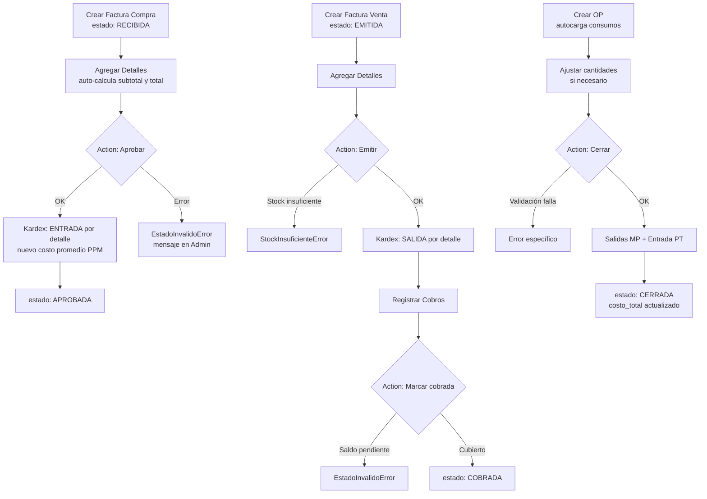

# LacteOps — Lógica de Negocio Sprint 0

> [!IMPORTANT]
> `python manage.py check` → **0 issues**. Todos los módulos importan limpiamente.

---

## Entregables implementados

### E1 · [apps/core/exceptions.py](file:///c:/Users/elier/Documents/Desarollos/LacteOps/apps/core/exceptions.py)

| Excepción | `code` | Constructor |
|---|---|---|
| [LacteOpsError](file:///c:/Users/elier/Documents/Desarollos/LacteOps/apps/core/exceptions.py#5-16) | `lacteops_error` | [(message)](file:///c:/Users/elier/Documents/Desarollos/LacteOps/apps/ventas/models.py#80-97) — clase base con `.message` accesible |
| [StockInsuficienteError](file:///c:/Users/elier/Documents/Desarollos/LacteOps/apps/core/exceptions.py#18-30) | `stock_insuficiente` | [(producto_nombre, disponible, requerido)](file:///c:/Users/elier/Documents/Desarollos/LacteOps/apps/ventas/models.py#80-97) |
| [EstadoInvalidoError](file:///c:/Users/elier/Documents/Desarollos/LacteOps/apps/core/exceptions.py#32-42) | `estado_invalido` | [(entidad, estado_actual, accion)](file:///c:/Users/elier/Documents/Desarollos/LacteOps/apps/ventas/models.py#80-97) |
| [UnidadIncompatibleError](file:///c:/Users/elier/Documents/Desarollos/LacteOps/apps/core/exceptions.py#44-57) | `unidad_incompatible` | [(unidad_consumo, unidad_producto)](file:///c:/Users/elier/Documents/Desarollos/LacteOps/apps/ventas/models.py#80-97) |
| [PeriodoCerradoError](file:///c:/Users/elier/Documents/Desarollos/LacteOps/apps/core/exceptions.py#59-69) | `periodo_cerrado` | [()](file:///c:/Users/elier/Documents/Desarollos/LacteOps/apps/ventas/models.py#80-97) — mensaje fijo de regla 2.8 |

---

### E2 · [apps/almacen/services.py](file:///c:/Users/elier/Documents/Desarollos/LacteOps/apps/almacen/services.py) — Kardex

#### [convertir_a_usd(monto, moneda, tasa_cambio)](file:///c:/Users/elier/Documents/Desarollos/LacteOps/apps/almacen/services.py#26-54)
- Si `moneda == 'USD'` → retorna directamente.
- Si `moneda == 'VES'` → valida `tasa > 0`, retorna `monto / tasa`.
- Todo con `Decimal`.

#### [registrar_entrada(producto, cantidad, costo_unitario, referencia, notas='')](file:///c:/Users/elier/Documents/Desarollos/LacteOps/apps/almacen/services.py#56-124)
- **`select_for_update()`** → bloqueo de fila para concurrencia segura.
- Promedio Ponderado Móvil:
  - Stock en 0 → `nuevo_costo = costo_unitario`
  - Stock > 0 → [(stock * costo_prom + cant * costo_unit) / (stock + cant)](file:///c:/Users/elier/Documents/Desarollos/LacteOps/apps/ventas/models.py#80-97)
- `transaction.atomic()` wrapping completo.
- Crea `MovimientoInventario` tipo `ENTRADA`.

#### [registrar_salida(producto, cantidad, referencia, notas='')](file:///c:/Users/elier/Documents/Desarollos/LacteOps/apps/almacen/services.py#126-187)
- **`select_for_update()`** → bloqueo de fila.
- Valida `stock >= cantidad` → si no: [StockInsuficienteError](file:///c:/Users/elier/Documents/Desarollos/LacteOps/apps/core/exceptions.py#18-30).
- Registra movimiento **antes** de descontar (para tener el `costo_promedio` correcto).
- Las salidas **NO modifican** el costo promedio.

---

### E3 · [apps/compras/models.py](file:///c:/Users/elier/Documents/Desarollos/LacteOps/apps/compras/models.py)

#### `DetalleFacturaCompra.save()`
```python
self.subtotal = cantidad * costo_unitario
super().save()
# Recalcula total cabecera con SUM de todos los detalles
self.factura.total = SUM(detalles.subtotal)
self.factura.save(update_fields=['total'])
```

#### `FacturaCompra.aprobar()`
- Valida `estado == 'RECIBIDA'` → [EstadoInvalidoError](file:///c:/Users/elier/Documents/Desarollos/LacteOps/apps/core/exceptions.py#32-42) si no.
- `transaction.atomic()`: para cada detalle → [convertir_a_usd](file:///c:/Users/elier/Documents/Desarollos/LacteOps/apps/almacen/services.py#26-54) + [registrar_entrada](file:///c:/Users/elier/Documents/Desarollos/LacteOps/apps/almacen/services.py#56-124).
- Cambia `estado = 'APROBADA'`.

#### `FacturaCompra.anular()`
- Rechaza si `estado == 'APROBADA'` o `'ANULADA'`.

---

### E4 · [apps/ventas/models.py](file:///c:/Users/elier/Documents/Desarollos/LacteOps/apps/ventas/models.py)

#### `DetalleFacturaVenta.save()`
- Igual que compras: `subtotal = cantidad * precio_unitario` + recalcula total cabecera.

#### `FacturaVenta.emitir()`
- Idempotente: verifica que no existan `MovimientoInventario` con `referencia == numero`.
- `transaction.atomic()`: para cada detalle → [registrar_salida](file:///c:/Users/elier/Documents/Desarollos/LacteOps/apps/almacen/services.py#126-187).

> [!NOTE]
> **Decisión de diseño:** [emitir()](file:///c:/Users/elier/Documents/Desarollos/LacteOps/apps/ventas/models.py#98-138) es un método explícito llamado vía Admin Action, **no** se dispara automáticamente en [save()](file:///c:/Users/elier/Documents/Desarollos/LacteOps/apps/ventas/models.py#80-97). Razón: en el flujo del Admin, cuando se guarda la cabecera, los detalles todavía no existen → las salidas serían 0. El operador crea la factura, agrega detalles, y luego selecciona la action **"Emitir facturas seleccionadas"**.

#### `FacturaVenta.marcar_cobrada()`
- Valida `estado == 'EMITIDA'`.
- Valida `SUM(cobros.monto) >= total` → [EstadoInvalidoError](file:///c:/Users/elier/Documents/Desarollos/LacteOps/apps/core/exceptions.py#32-42) con monto pendiente si no.

---

### E5 · [apps/produccion/models.py](file:///c:/Users/elier/Documents/Desarollos/LacteOps/apps/produccion/models.py)

#### `OrdenProduccion.save()`
- En creación (`_state.adding`): llama [cargar_consumos_desde_receta()](file:///c:/Users/elier/Documents/Desarollos/LacteOps/apps/produccion/models.py#96-118) post-save.

#### `OrdenProduccion.cargar_consumos_desde_receta()`
- Crea un [ConsumoOP](file:///c:/Users/elier/Documents/Desarollos/LacteOps/apps/produccion/models.py#231-246) por cada [RecetaDetalle](file:///c:/Users/elier/Documents/Desarollos/LacteOps/apps/produccion/models.py#45-58).
- `costo_unitario` inicial = `materia_prima.costo_promedio` vigente.

#### `OrdenProduccion.cerrar()`
Flujo en dos fases:

**Fase 1 — Validaciones (ANTES de la transacción):**
1. `estado == 'ABIERTA'`
2. `cantidad_producida > 0`
3. Para cada consumo: unidad del ConsumoOP == unidad del producto → [UnidadIncompatibleError](file:///c:/Users/elier/Documents/Desarollos/LacteOps/apps/core/exceptions.py#44-57)
4. Para cada consumo: `stock_actual >= cantidad_consumida` → [StockInsuficienteError](file:///c:/Users/elier/Documents/Desarollos/LacteOps/apps/core/exceptions.py#18-30)

**Fase 2 — `transaction.atomic()`:**
1. Refresca `costo_unitario` de cada ConsumoOP al costo promedio del momento del cierre.
2. [registrar_salida](file:///c:/Users/elier/Documents/Desarollos/LacteOps/apps/almacen/services.py#126-187) de cada materia prima.
3. `costo_total = SUM(consumo.subtotal)`.
4. `costo_unitario_pt = costo_total / cantidad_producida`.
5. [registrar_entrada(producto_terminado, cantidad_producida, costo_unitario_pt)](file:///c:/Users/elier/Documents/Desarollos/LacteOps/apps/almacen/services.py#56-124).
6. Guarda `costo_total`, `fecha_cierre = date.today()`, `estado = 'CERRADA'`.

> [!WARNING]
> Si cualquier salida falla por stock insuficiente dentro de la transacción, **todo se revierte** — incluyendo los consumos anteriores ya procesados. Esto garantiza el principio "todo o nada" de la regla 2.5.

#### `OrdenProduccion.anular()`
- Solo desde `estado == 'ABIERTA'`.

---

### E6 · Admin Actions

Patrón aplicado en los tres módulos:

```python
def action_name(modeladmin, request, queryset):
    for obj in queryset:
        try:
            obj.metodo()
            messages.success(request, f'Exitoso: {obj}')
        except LacteOpsError as e:
            messages.error(request, f'Error en {obj}: {e.message}')
        except Exception as e:
            logger.error('Error inesperado en %s: %s', obj, e, exc_info=True)
            messages.error(request, f'Error inesperado en {obj}. Ver logs.')
```

| Módulo | Action | Método |
|---|---|---|
| Compras | [aprobar_facturas](file:///c:/Users/elier/Documents/Desarollos/LacteOps/apps/compras/admin.py#43-53) | `factura.aprobar()` |
| Compras | [anular_facturas](file:///c:/Users/elier/Documents/Desarollos/LacteOps/apps/compras/admin.py#56-66) | `factura.anular()` |
| Ventas | [emitir_facturas](file:///c:/Users/elier/Documents/Desarollos/LacteOps/apps/ventas/admin.py#61-71) | `factura.emitir()` |
| Ventas | [marcar_cobradas](file:///c:/Users/elier/Documents/Desarollos/LacteOps/apps/ventas/admin.py#74-84) | `factura.marcar_cobrada()` |
| Producción | [cerrar_ordenes](file:///c:/Users/elier/Documents/Desarollos/LacteOps/apps/produccion/admin.py#42-52) | `orden.cerrar()` |
| Producción | [anular_ordenes](file:///c:/Users/elier/Documents/Desarollos/LacteOps/apps/produccion/admin.py#55-65) | `orden.anular()` |

---

## Flujo de uso típico


